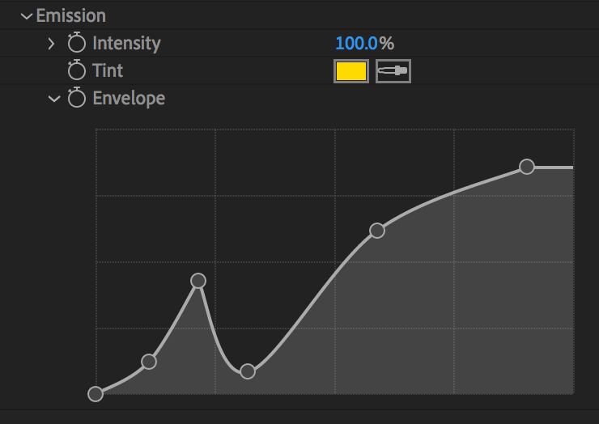

# `uniform-cubic-splines`

Uniform cubic spline interpolation & inversion.

[](https://docs.rs/uniform-cubic-splines/)
[](https://crates.io/crates/uniform-cubic-splines)

This crate supports the following types of splines:

- [B-spline](https://en.wikipedia.org/wiki/B-spline)
- [Bezier](https://en.wikipedia.org/wiki/Composite_B%C3%A9zier_curve)
- [Catmull-Rom](https://en.wikipedia.org/wiki/Cubic_Hermite_spline#Catmull%E2%80%93Rom_spline)
- [Hermite](https://en.wikipedia.org/wiki/Cubic_Hermite_spline)
- Linear
- Power



_Curve widget with a 1D Catmull-Rom spline with non-uniform knot
spacing and knot multiplicity using this crate for interpolation
(drawn using `tiny-skia`)._

The crate uses generics to allow interpolation of any type for which
certain traits are defined.

I.e. you can use this crate to interpolate splines in 1D, 2D, 3D, etc.

```toml
[dependencies]
uniform-cubic-splines = { version = "0.4" }
```

## Example

Using a combination of `spline_inverse()` and `spline()` it is
possible to compute a full spline-with-nonuniform-abscissæ:

```rust
use uniform_cubic_splines::prelude::*;

// We want to evaluate the spline at knot value 0.3.
let x = 0.3;

// The first and last points are never interpolated.
let knot_spacing = [0.0, 0.0, 0.1, 0.3, 1.0, 1.0];
let knots        = [0.0, 0.0, 1.3, 4.2, 3.2, 3.2];

let v = spline_inverse::<CatmullRom, _>(x, &knot_spacing).unwrap();
let y = spline::<CatmullRom, _, _>(v, &knots).unwrap();

assert!((y - 4.2).abs() < 1e-6);
```

## Features

- `monotonic_check` -- The
  [`spline_inverse()`](https://docs.rs/uniform-cubic-splines/latest/uniform_cubic_splines/fn.spline_inverse.html)/[`spline_inverse_with()`](https://docs.rs/uniform-cubic-splines/latest/uniform_cubic_splines/fn.spline_inverse_with.html)
  code will check if the knot vector is monotonic (_enabled_ by default). **Performance impact**: Disabling this feature can improve `spline_inverse` performance by ~5-10% by eliminating monotonicity validation overhead. Only disable if you can guarantee monotonic input, as non-monotonic knots will produce undefined results.

## Using with Math Libraries

The `Spline` trait can be implemented for vector types from external math libraries. See the `tests/nalgebra_integration.rs` file for a complete example of implementing the trait for `nalgebra::Vector3<f32>` and `nalgebra::Point3<f32>`.

```rust
use nalgebra::Vector3;
use uniform_cubic_splines::{spline, CatmullRom};

// After implementing the Spline trait for Vector3<f32>
let knots = vec![
    Vector3::new(0.0, 0.0, 0.0),
    Vector3::new(1.0, 1.0, 1.0),
    Vector3::new(2.0, 0.0, 2.0),
    Vector3::new(3.0, -1.0, 3.0),
];

let result = spline::<CatmullRom, _, _>(0.5, &knots).unwrap();
```

Note that vector types from math libraries need custom `Spline` implementations because:
- The interpolation parameter `x` must be a scalar (f32/f64)
- Vectors don't implement the `Float` trait
- Component-wise interpolation requires custom logic

See `tests/nalgebra_integration.rs` for an example of implementing the `Spline` trait for vector types using wrapper structs.

## `f16` & `f128` Support

This crate supports `f16` and `f128` types on a `nightly` toolchain if you use this repository as an overlay in your `Cargo.toml`.

```toml
[patch.crates-io]
uniform-cubic-splines = {
    git = "https://github.com/virtualritz/uniform-cubic-splines.git"
}
```

> This will be supported without an overlay once [this PR on `num-traits`](https://github.com/rust-num/num-traits/pull/333) is merged and published.

## Background

The code was originally a Rust port of the implementation found in the [Open
Shading Language](https://github.com/imageworks/OpenShadingLanguage)
C++ source. However, it has since diverged significantly with numerous
optimizations and improvements:

- **Optimized `spline_inverse`**: Uses binary search for segment location
  (O(log n) instead of O(n)) for splines with >12 segments.
- **Improved segment range detection**: Evaluates actual spline values at
  segment boundaries instead of just checking control points.

If you come from a background of computer graphics/shading languages used in offline rendering this crate should feel like home.

## Performance

The implementation has been heavily optimized beyond the original OSL C++ source.

### Key Optimizations

- **Binary search in `spline_inverse`**: For splines with >12 segments, uses
  binary search (O(log n)) instead of linear search (O(n)), providing up to
  7x speedup for 1,000+ segments.
- **Adaptive root-finding**: Illinois modification of Regula Falsi with
  automatic fallback to bisection for robust convergence.
- **Optimized polynomial evaluation**: Uses Horner's method for efficient
  cubic polynomial evaluation.

### Architecture Changes in v0.5

- **Trait-based design**: The new [`Spline`](https://docs.rs/uniform-cubic-splines/latest/uniform_cubic_splines/trait.Spline.html) trait allows specialized implementations for different types.
- **Error handling**: Functions now return `Result<T, SplineError>` instead of panicking on invalid inputs.

### Benchmarks

Performance for scalar types (`f32` and `f64`):

| **Points** | `f32 spline()` | `f32 spline_inverse()` | `f64 spline()` | `f64 spline_inverse()` |
| ---------- | -------------- | ---------------------- | -------------- | ---------------------- |
| 10         | 2.4 ns         | 19 ns                  | 2.3 ns         | 18 ns                  |
| 50         | 2.4 ns         | 39 ns                  | 2.4 ns         | 39 ns                  |
| 100        | 2.4 ns         | 62 ns                  | 2.4 ns         | 72 ns                  |
| 500        | 2.4 ns         | 265 ns                 | 2.6 ns         | 263 ns                 |

_Benchmarks taken on Ubuntu with `rustc 1.83.0-nightly` on an AMD Ryzen 7 6800H laptop._

The trait-based architecture allows external math libraries to provide their own optimized implementations for vector types.
